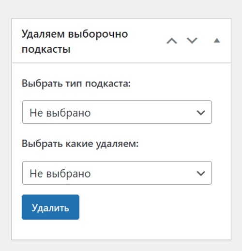

# 1. Плагин массовое удаление элементов ACF по признаку.
Задача: Реализовать массовое удаление элементов поля repeater по ТЗ в виде плагина.
___
На сайте установлен плагин ACF (Advanced Custom Fields PRO).
Для записей создано поле типа (repeater) с вложенными полями.
Таких повторителей создано два 
* podborka_projects
* podborka_featured_projects

с вложенными полями.

[Импорт в ACF PRO](https://github.com/DoubleDayCompany/Test-task-Double-Day/blob/aa06befc04fb9654b3bf98c2858fce6b67313c8c/acf-export-2023-02-10.json)
С помощью повторителей заполняем 20-50 элементов поля с заполнением полей.
Далее нас интересует возможность массово удалять элементы repeater по признаку поля "тип подкаста"
На странице редактирования записей появляется метабокс 

Где Выбрать тип подкаста (это наши поля repeater) а выбрать какие удаляем подкасты это (тип подкаста)
Далее после нажатия Удалить, происходит удаление только выбранных элементов поля repeater.

__Важно__

* учитывать что поля repeater это константа а вот поле "тип подкаста" может дополняться значениями.
* Поставить прелоадер, чтобы пользователь видел, что идет удаление. 
* После удаления и обновления страницы писать, что запись обновлена, и элементы по признаку удалены.
* Оформить в виде плагина

***

# 2. Плагин подсчета символов постов.
Задача: Реализовать плагин подсчёта симвовов статьи.
На странице "Все записи" где выводится список постов. Добавить __сортируемое__ поле рядом с "Дата" которое будет считать количество символов поста.

__Важно__

* Оформить в виде плагина
* Поле должно быть сортируемым.
* оформить удаление поля при отключении плагина.

# 3. Плагин создания custom post (Статьи) .
Задача: В виде плагина реализовать создания типа постов article (custom post).
Уже созданному типу постов добавляем два метабокса:
* количество просмотров __(тип - текст)__
* закрепить в лучшем __(тип - дата)__

### количество просмотров
Поле типа "текст" должно выводиться в __общем списке постов__ в админ панели и должно быть __сортируемым__ . Аналогично с заданием #2. Для создания дополнительного поля __не используем ACF__ а пользуемся произвольными полями Wordpress. 

### закрепить в лучшем
Поле типа "дата" где можно выставить дату в формате ГГГГ-мм-дд , возможность указать дату поста.

Далее оформить возможность с помощью хука вывести в любое место в шаблоне __(именно сам шаблон а не редактор)__ посты custom post (acticle) только те у которых дата которую создали выше, еще не прошла.

__Важно__

* Не использовать сторонние плагины для создания кастомного типа постов и доп. полей.

